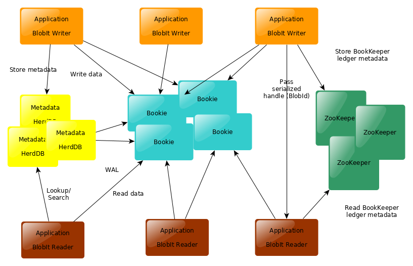
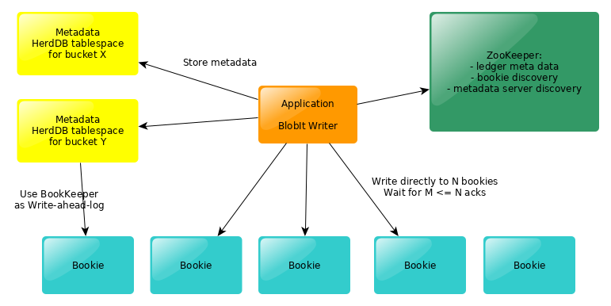

[](https://travis-ci.org/diennea/blobit)

# BlobIt

BlobIt is a ditributed binary large objects (BLOBs) storage built upon Apache BookKeeper

# Overview

BlobIt stores *BLOBS* (binary large objects) in *buckets*, a bucket is like a namespace.
Multitenanty is fundamental in BlobIt architecture and it is expected that each
*tenant* uses its own bucket.

Data is stored on a [Apache BookKeeper](https://bookkeeper.apache.org) cluster, 
and this automagically enables BlobIt to scale horizontally, the more *Bookies* you have
the more amount of data you will be able to store.

BlobIt needs a *metadata service* in order to store refecences to the data, it ships
by default with [HerdDB](https://herddb.org), which is also built upon BookKeeper.

# Architectural overview

BlobIt is designed for performance and expecially low latency in this scenario:
the *writer* stores one BLOB and *readers* immediately read such BLOB (usually from different machines).
This is the most common path in [EmailSuccess](https://emailsuccess.com), as BlobIt
is the core datastore for it.
Blobs are supposed to be retained for a couple of weeks, not for very long term,
but there is nothing in the design of BlobIt that prevents you for storing data for
years.

BlobIt clients talk directly to Bookies both for reads and writes, this way
we are exploiting directly all of the BookKeeper optimizations on the write and read path.
This architecture is totally decentralized, there is no BlobIt server.
You can use the convenience binaries [BlobIt service](blobit-service) that is simply a pre-package bundle
able to run ZooKeeper, BookKeeper, HerdDB and a REST API.

You can see BlobIt as simple extension to BookKeeper, with a metadata layer which makes it simple to:
- reference Data using a user-supplied name (in form of bucketId/name)
- organize efficently data in BookKeeper, an allow deletion of BLOBs.



# Writes

Batches of Blobs are stored in BookKeeper ledgers (using the WriteHandleAdv API),
We are storing more then one BLOB inside one BookKeeper ledger.
BlobIt will collect unused ledgers and delete them.

When a Writer stores a BLOB it receives immedialy an unique ID of the blob,
this ID is unique in the whole cluster, not only in the scope of the bucket.
Such ID is a "smart id" and it contains all of the information needed to retrieve
data without using the metadata service.

Such ID contains information like:
- the ID of the ledger (64bit)
- fist entry id (64bit)
- number of entries (32bit)
- size of the entry (64bit)

With such information it is possible to read the whole BLOB or even only parts.
An object is immutable and it cannot be modified.

The client can assign a custom name, unique inside the context of the Bucket,
Readers will be able to access the object using this key.
You can assign the same key to another object, this way 

If you are using custom keys the writer and the reader have to perform an additional RPC
to the metadata service.



BookKeeper client stores data in immutable ledgers, and performs writes to a 
quorum of Bookies, which are only dta storage nodes.
Each ledger will be written to several bookies, and all the information
needed for data retrival is stored on ZooKeeper.
ZooKeeper also stores data for Bookie discovery.

So the normal write flow is:
* create a new ledger:
  * choose a set of available Bookies using ZooKeeper
  * write new ledger metadata to ZooKeeper
*  write each part of the BLOB directly to the Bookies
*  record on the metadata service (HerdDB) which entries of the ledger contains the data
  * perform an RPC to the HerdDB tablespace ledger for the bucket to write  metadata
  * the database will perform a write on BookKeeper (still to a quorum of bookies)

The metadata service is decentralized: each bucket will have a dedicated *tablespace* on HerdDB,
this leader will be indipendent from the ledgers of other tablespaces of otherbuckets,
this way the system will scale horizonally with the number of Buckets.

# Reads

BlobIt clients read data directly from Bookies. Because the objectId
contains all of the information to access the data.
In case of lookup by custom key a lookup on the metadata service is needed.

The reader can read the full Blob of parts of it.
BlobIT supports a Streaming API for reads, suitable for very large objects:
as soon as data comes from BookKeeper it is streamed to the application: Think about
an HTTP service which retrieves an object and serves it directly to the client.

# Buckets and data locality

You can use Buckets in order to make it possible to store
data nearby the writer or the reader.
BlobIt is able to use an *HerdDB tablespace* for each bucket, this way all of the metadata
of the bucket will be handled using the placement policies configured in the system.

This is very important, because each Bucket will be able to survive and work
indipendently from the others.

A typical scenario is to move readers, writers and the primary copy metadata and data 
next to each other, and have replicas on other machines/racks.
Both for the metadata service (HerdDB) and the data service (BookKeeper) replicas
will be activated immediately as soon as the reference machines are no more available
without any service outage.

# Deleting data

Data deletion is the most tricky part, because BlobIt is storing more than
one BLOB inside the same ledeger, so you can delete a ledeger only when there is
no live BLOB stored in it.
We have a garbage collector system which makes maintenance of the Bucket and 
deleted data from BookKeeper when it is no more needed.
Bookies in turn will do their own Garbage Collection, depending on the configuration.
So disk space won't be reclaimed as soon as a BLOB is deleted.

BlobIt garbage collection is totally decentralized, any client can run the
procedure, and it runs per bucket.
Even in this case it is expected that services which operate on a bucket
are co-located and take care of running the garbage collection in a timely manner.
Usually it makes sense to run the GC of a bucket after deleting a batch of BLOBs of the same bucket.

# Java Client example

A tipical writer looks like this:

```
String BUCKET_ID = "test";
byte[] TEST_DATA = "foo".getBytes();
HerdDBDataSource datasource = new HerdDBDataSource();
datasource.setUrl("jdbc:herddb:localhost");
Configuration configuration
                = new Configuration()
                    .setType(Configuration.TYPE_BOOKKEEPER)
                    .setConcurrentWriters(10)
                    .setUseTablespaces(true)
                    .setZookeeperUrl(env.getAddress());
try (ObjectManager manager = ObjectManagerFactory.createObjectManager(configuration, datasource);) {      
      manager.createBucket(BUCKET_ID, BUCKET_ID, BucketConfiguration.DEFAULT).get();

      BucketHandle bucket = manager.getBucket(BUCKET_ID);
      String id = bucket.put(null, TEST_DATA).get();
}
```

A typical reader looks like this:

```
String BUCKET_ID = "test";
byte[] TEST_DATA = "foo".getBytes();
HerdDBDataSource datasource = new HerdDBDataSource();
datasource.setUrl("jdbc:herddb:localhost");
Configuration configuration
                = new Configuration()
                    .setType(Configuration.TYPE_BOOKKEEPER)
                    .setConcurrentWriters(10)
                    .setUseTablespaces(true)
                    .setZookeeperUrl(env.getAddress());
try (ObjectManager manager = ObjectManagerFactory.createObjectManager(configuration, datasource);) {      
      manager.createBucket(BUCKET_ID, BUCKET_ID, BucketConfiguration.DEFAULT).get();

      BucketHandle bucket = manager.getBucket(BUCKET_ID);
      
      byte[] data = bucketReaders.get(it).get();
}
```

Most of the APIs are async and they are based on CompletableFuture.

REST API

We are delivering a REST service which is (almost) compatible with [Open Stack Swift API](https://docs.openstack.org/swift/latest/api/object_api_v1_overview.html).
This service is still in ALPHA phase and it is currently used in order to perform
benchmarks and comparisons with other products.

Security

As BlobIt is mostly a layer on top of BookKeeper, ZooKeeper and HerdDB all of the security
aspects are handled directly but low level clients.
Our suggestion is that you enable SASL/Kerberos authentication on all of such services.
There is no support for other security features, because we expecte the client application
to be in charge for handling semantics of buckets/blobs.

## Getting in touch

Feel free to create issues in order to interact with the community.

Documentation will come soon, start with the examples inside the test cases
in order to understand better how it works.

Please let us know if you are trying out this project, we will be happy to hear about your
case and help you.

## License

BlobIt is under [Apache 2 license](http://www.apache.org/licenses/LICENSE-2.0.html).
